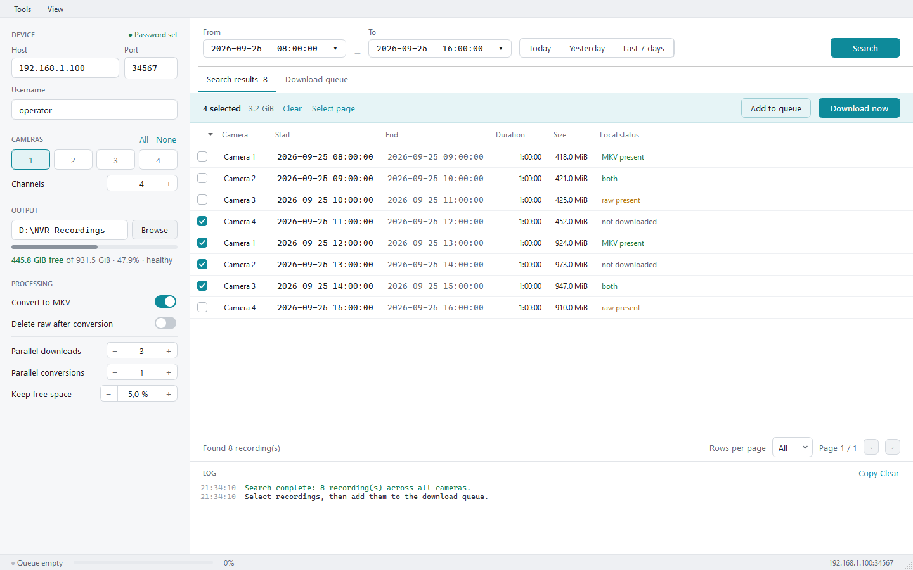
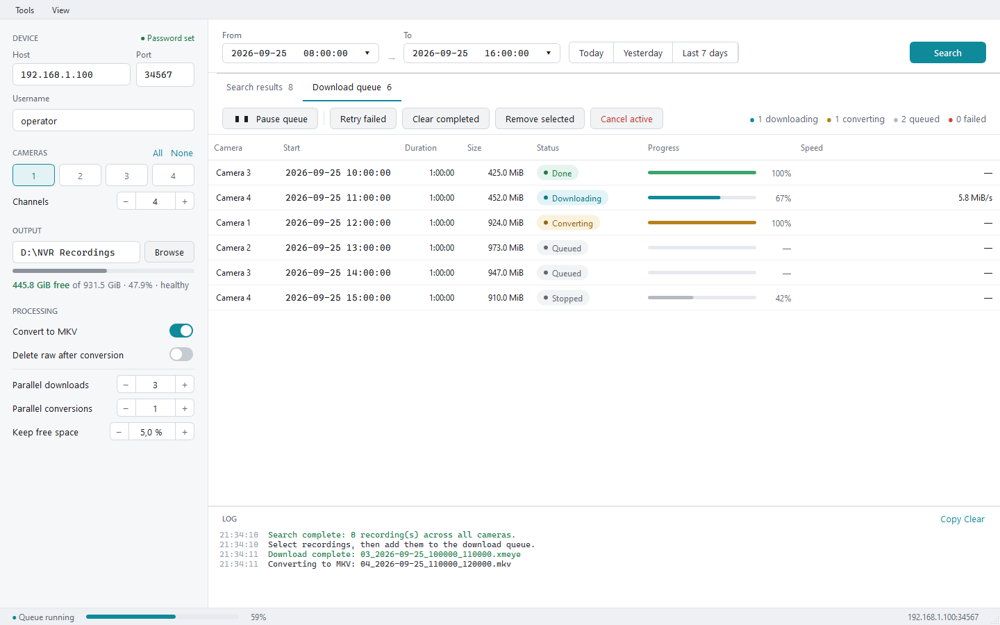

# Desktop GUI guide

`nvr_gui.py` is a Windows-friendly desktop front end for searching XMEye NVR
archives, downloading recordings, repairing damaged record streams, and
converting them to validated MKV files.

The instructions and screenshots in this guide have been verified on Windows.
Linux support has not yet been tested.

The GUI calls the Python backend directly. It does not parse CLI output, and
long-running search, download, conversion, and repair work runs outside the UI
thread.

> The screenshots below use demonstration addresses, names, recordings, and
> paths. No real credentials or recordings are included.

## Install and launch

Requirements:

- Python 3.10 or newer
- FFmpeg and `ffprobe` available on `PATH`
- the packages in `requirements.txt`

### Install FFmpeg on Windows

Both `ffmpeg.exe` and `ffprobe.exe` are required. They are included in the same
FFmpeg package.

The simplest installation method is WinGet. In PowerShell or Command Prompt:

```powershell
winget install --id Gyan.FFmpeg.Essentials --exact
```

If WinGet is unavailable, open the official
[FFmpeg download page](https://ffmpeg.org/download.html), choose one of the
linked **Windows EXE Files** providers, download a Windows build, and extract
it. Add the extracted `bin` directory—the directory containing `ffmpeg.exe`
and `ffprobe.exe`—to the user or system `PATH`.

After either installation method, close and reopen PowerShell so it receives
the updated `PATH`, then verify both programs:

```powershell
ffmpeg -version
ffprobe -version
```

If either command is not recognized, FFmpeg is not yet visible on `PATH`. For
a manual installation, check that the `bin` directory itself, rather than only
its parent directory, was added. These commands show which executables Windows
will use when configuration is correct:

```powershell
Get-Command ffmpeg
Get-Command ffprobe
```

### Install the Python packages and launch the GUI

From PowerShell in the repository directory:

```powershell
python -m pip install -r requirements.txt
$env:XMEYE_PASSWORD = "your NVR password"
python scripts\nvr_gui.py
```

The password is read from `XMEYE_PASSWORD` when an operation starts. It is not
saved in `QSettings` and is never displayed in the interface. Restart the GUI
after setting the variable if it was launched from a process that did not
inherit it.

## Search recordings

1. Enter the NVR host, DVRIP port, and username.
2. Set the number of channels and select the cameras to search.
3. Choose an output directory.
4. Select an exact start and end date/time, or use **Today**, **Yesterday**, or
   **Last 7 days**.
5. Select **Search**. The same button cancels an active search.
6. Select recordings and use **Add to queue** or **Download now**.



Search results are paged independently from selection. Changing pages does not
discard already selected recordings. The **Local status** column reports:

- `not downloaded`
- `raw present`
- `MKV present`
- `both`

The status is cached while the table is displayed and refreshed after file
operations, avoiding repeated filesystem scans during painting and sorting.

## Processing options

### Convert to MKV

Runs the timestamp-aware converter after downloading. The converter:

- preserves the encoded H.264/H.265 video rather than re-encoding it;
- preserves supported FA audio when present;
- reconstructs monotonic packet timestamps from XMEye FC/GOP timestamps;
- strict-decodes and validates the complete output before publication;
- writes the final MKV atomically.

If structural XMEye damage prevents conversion, the backend creates a temporary
sanitized copy and retries once. The original retained `.xmeye` file is not
overwritten by this repair attempt.

### Delete raw after conversion

Deletes the `.xmeye` file only after a validated conversion succeeds. If
automatic repair was required, the raw file is always kept even when this
option is enabled.

Leave the option disabled when the source stream may be useful for later
analysis or a different conversion. Enable it for routine downloads where the
validated MKV is the desired final artifact.

### Parallel work and free-space limit

- **Parallel downloads** controls simultaneous DVRIP transfers.
- **Parallel conversions** controls simultaneous FFmpeg processes.
- **Keep free space** pauses the queue before a new download when free disk
  space falls below the configured percentage.

Each queued item stores a snapshot of its NVR connection, output directory,
conversion, deletion, and free-space settings. Editing the sidebar later does
not redirect work already in the queue.

## Download queue



The queue shows per-recording state, progress, and current download speed.

- **Start queue / Pause queue** controls whether new downloads may start.
  Pausing does not interrupt active work; already downloaded recordings may
  continue through conversion.
- **Cancel active** interrupts current socket reads and converter process trees.
  The queue remains enabled, so another queued item may start afterward.
- **Retry failed** returns failed, stopped, or cancelled items to `Queued`.
- **Clear completed** removes completed rows without deleting their files.
- **Remove selected** removes inactive rows from the queue.

Right-click a queue row for:

- **Download again** — force a fresh download for that recording;
- **Stop** — stop a queued, downloading, or converting item;
- **Delete local file** — explicitly delete its local raw and/or MKV files;
- **Remove from queue** — remove an inactive queue entry.

Closing the window while work is active first disables new scheduling,
interrupts active downloads and conversions, and waits for the workers and
process trees to exit before closing.

## Files and interrupted downloads

Downloads are written to `filename.xmeye.part`. The backend renames that file
to `filename.xmeye` with `os.replace()` only after the NVR sends a clean end
marker and the streaming sanitizer finishes successfully.

Consequently:

- a final `.xmeye` file is treated as a completed download;
- a `.part` file is incomplete and is never treated as a reusable recording;
- an existing `.xmeye` can be converted without downloading it again;
- **Download again** is available when a source copied from elsewhere is
  suspect;
- no `.complete` sidecar files, manifest, hidden metadata directory, or
  registry entries are created.

`FileLength` reported by some XMEye firmware is not reliable enough to decide
whether a clean download is complete. It remains useful for progress reporting,
but the atomic `.part` to `.xmeye` publication is the completion boundary.

The streaming sanitizer may discard invalid padding or garbage between valid
declared-length XMEye records. The retained `.xmeye` is therefore the cleaned
record stream produced by the downloader, not a byte-for-byte dump of every
network payload.

## Manual repair

Use **Tools → Repair .xmeye...** to create a separate sanitized copy of an
existing recording. Repair never overwrites its input. It parses declared frame
lengths, resynchronizes only at validated record boundaries, and truncates an
incomplete trailing record when necessary.

Use this command for recordings obtained outside the GUI or for manual
investigation. Normal GUI conversion already performs one automatic temporary
repair attempt when it encounters recognized structural damage.

## Troubleshooting

### `XMEYE_PASSWORD is not set`

Set the variable in the same PowerShell session before starting the GUI:

```powershell
$env:XMEYE_PASSWORD = "your NVR password"
python scripts\nvr_gui.py
```

### A download appears stalled

Archive playback on many XMEye devices is bursty. Gaps of tens of seconds can
be normal. Use the log and speed indicator before deciding that the operation
is stuck. **Cancel active** closes the active DVRIP socket rather than merely
setting a passive UI flag.

### Conversion fails

The raw input is retained. Review the log for structural damage, unsupported
audio, strict-decode errors, or missing FFmpeg executables. You can retry the
queue item or run the manual repair command while preserving the source.

### Seeking repeatedly in VLC reaches the end early

The converted stream has validated monotonic timestamps, but repeated relative
seek commands in VLC can make its displayed clock drift from the decoded frame,
especially around GOP/keyframe boundaries. A single direct seek or normal
playback near the end avoids that player-side effect; it does not indicate
extra packets beyond the validated MKV duration.
